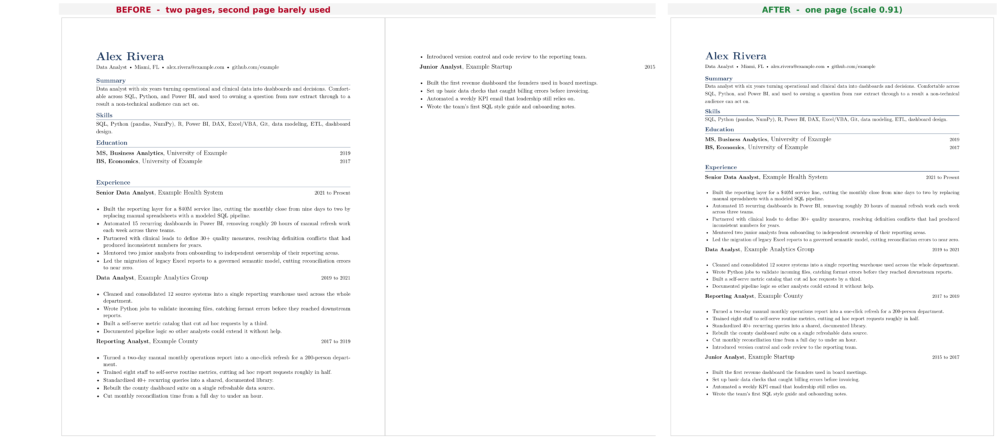


A side project that fits a LaTeX resume, CV, or any knob-wired document to an exact page count by turning one scaling value and searching for the tightest fit that still holds.


## At a Glance

A resume that almost fits is its own kind of annoying. You write two solid pages and three stray lines push onto a third, or you trim too hard and the second page sits half empty. Either way you end up hand-tuning font sizes and margins, recompiling, and eyeballing the result over and over.

`resume-tex-fit` turns that fiddling into one search. The document exposes a single scaling command, and every font size, line height, and gap is computed from it. The tool edits that one number, compiles with `xelatex`, reads the page count from the log, and searches for the largest scale that still fits the target. Locking the largest scale means the last page fills as much as it can without spilling.

It runs from the terminal for scripting, or opens a small tkinter window with a file picker if you would rather click. The core fit uses only the Python standard library, so past a working LaTeX distribution there is nothing to install.

## The Problem

The usual ways to force a page count all have a catch. Nudging one font size shifts everything downstream, so you chase the overflow around the document. Scaling the whole thing down to hit a count often lands on a size that is too small to read or that an applicant tracking system mishandles. Padding a short page with inflated type reads as exactly what it is. And however you got it to fit this time, you redo the whole thing the next time you edit a bullet.

The common thread is that every fix is manual and none of it is repeatable.

## The One Knob

The tool does not parse your layout or resize elements one by one. It turns a single density knob, `\rs`, and recompiles. In a document built for this, each size is written as a base number times `\rs`, so `\rs` at 1.000 gives the normal sizes, 0.95 shrinks everything 5%, and 1.03 grows it 3%. That one value scales the whole document, and it is the only thing the tool changes.

Wiring it up is a few lines in the preamble. You need `xfp` for the arithmetic, the knob itself, and two small helpers so the rest of the document never writes a raw size:

```latex
\usepackage{xfp}                         % \fpeval for inline arithmetic

% The one knob resume-tex-fit turns. Keep it at 1.000 in source; the tool sets it.
\newcommand{\rs}{1.000}

% \fs{size}{leading} selects a font size and line spacing, both scaled by \rs.
\newcommand{\fs}[2]{\fontsize{\fpeval{#1*\rs}}{\fpeval{#2*\rs}}\selectfont}

% \sv{pt} inserts vertical space scaled by \rs.
\newcommand{\sv}[1]{\vspace{\fpeval{#1*\rs}pt}}
```

From there body text uses `\fs{10}{11.7}`, a section gap uses `\sv{6}`, and every size traces back to `\rs`. The knob is a hard dependency by design: if the `.tex` does not route its sizing through `\rs`, there is nothing to turn and the tool refuses to run.

## What a Run Looks Like

The repo ships a deliberately overloaded `demo.tex` that runs onto a second page at normal size. Target one page:

```bash
python3 resume-tex-fit.py demo.tex --pages 1
```



It binary-searches the density and locks the largest scale that still holds one page:

```
Fitting demo.tex to 1 page(s) (scale range 0.90-1.05):
  scale 1.0000 -> 2 page(s)
  scale 0.9000 -> 1 page(s)
  scale 0.9500 -> 2 page(s)
  scale 0.9250 -> 2 page(s)
  scale 0.9125 -> 2 page(s)
  scale 0.9062 -> 1 page(s)
  scale 0.9094 -> 1 page(s)
  scale 0.9064 -> 1 page(s)

Locked scale 0.9064 -> 1 page(s). Backup saved as demo.tex.bak.
```

The only edit it makes to your file is the one knob:

```diff
-\newcommand{\rs}{1.000}
+\newcommand{\rs}{0.9064}
```

Every size, line height, and gap recomputes from that value, so the whole document tightens by the same proportion instead of one part getting cramped. The original is saved as `demo.tex.bak` next to it.

## The Search

From a target page count to a locked scale, the tool runs a fixed sequence. It checks feasibility against the document's natural size, not against the scale ceiling, so a longer target does not pad a short resume unless you turn on Force Fit.


flowchart TD
    A[Read target page count] --> B{Does the .tex route sizing through the rs knob?}
    B -- no --> X[Refuse and exit]
    B -- yes --> C[Compile at natural size to check feasibility]
    C --> D{Does the target fit the normal scale range?}
    D -- too long --> E[Report overflow and cut guidance, then restore]
    D -- too short --> F[Report the page count reached and decline to pad]
    D -- feasible --> G[Binary-search for the largest scale that still fits]
    G --> H[Back off the boundary slightly so a reflow cannot spill]
    H --> I[Write the knob, save .tex.bak, report the locked scale]


## Walking Through the Fit

### Reading the Page Count

Every step of the search reduces to one question: at this scale, how many pages does the document compile to? The tool answers it by running `xelatex` once and reading the answer straight out of the LaTeX log, which prints the final page count on the line that reports the output file.

```python
PAGES_RE = re.compile(r"Output written on .*?\((\d+)\s+pages?\)")

def compile_pdf(tex, log):
    """Compile once; return the page count. Raise FitError on failure."""
    proc = subprocess.run(
        ["xelatex", "-interaction=nonstopmode", "-halt-on-error", tex.name],
        cwd=tex.parent, stdout=subprocess.DEVNULL, stderr=subprocess.DEVNULL,
        timeout=COMPILE_TIMEOUT,
    )
    # ... on failure, surface the first LaTeX error line so the user
    #     does not have to open the log to see what broke ...
    matches = PAGES_RE.findall(logf.read_text(encoding="utf-8", errors="ignore"))
    return int(matches[-1])
```

`-halt-on-error` stops the compile at the first real error instead of letting it limp along, and `-interaction=nonstopmode` keeps `xelatex` from waiting on a keystroke that a background run would never send. Reading the count from the log rather than opening the PDF means the fit never needs a PDF library for its core loop.

### The Binary Search

Feasibility is judged against the document at neutral density, not against the scale range. Compiling once at `\rs = 1.000` gives the natural page count, and every branch (fits, too long, too short) keys off that number.

```python
# Judge feasibility against the natural size at neutral density, not the
# ceiling, so a larger target never pads the doc by inflating type.
p0 = page_count(1.0)
```

Once the target is feasible, the search itself is a plain bisection over the scale. Page count falls as the scale shrinks, so the tool narrows the interval toward the largest scale that still holds the target, keeping the best passing scale as it goes.

```python
best = lo
for _ in range(MAX_ITERS):
    if hi - lo < TOLERANCE:
        break
    mid = (lo + hi) / 2.0
    if page_count(mid) <= target:
        best, lo = mid, mid
    else:
        hi = mid
```

The loop caps at `MAX_ITERS` and also stops once the interval closes below `TOLERANCE`, so it terminates even on a document where the page boundary never lands exactly on a tested scale. The assumption underneath is that page count rises with scale, which holds almost always. LaTeX reflow can occasionally shuffle a widow or float across a boundary and break it, in which case a fit can come out a page off until a small edit and rerun settles it.

### Backing Off the Boundary

Locking the exact boundary scale would leave no slack, so a later edit that reflows one line could push the document over. After the search, the tool steps back a hair from the boundary, spending a little density to buy that margin. The one case it skips is a forced grow, where the best scale already sits at the top of the target window and backing off would drop below target and trip a false "too sparse".

```python
# Back off the boundary so a reflow can't spill into an extra page. Skip
# it when growing: there best sits at the top of the target-page window,
# and backing off could drop below target and trip a false "too sparse".
if not grew:
    best = max(floor, best - SAFETY)
final = render(best)
```

`SAFETY` is a small fixed step, and `floor` clamps the backoff so it never pushes below the legibility floor the run is working within.

## Under The Hood

Two implementation pieces worth a closer look.





The knob is the tool's only hook into the document, so the first thing it does is confirm the knob exists. A single regex looks for `\newcommand{\rs}{...}` in the source, tolerant of whitespace, and a second pass counts standard resume sections to guess whether the file is a resume at all.

```python
KNOB_RE = re.compile(r"(\\newcommand\s*\{\s*\\rs\s*\}\s*\{)\s*([0-9.]+)\s*(\})")

def check_tex(path):
    """Inspect a .tex without compiling. Returns a dict describing fitness."""
    text = path.read_text(encoding="utf-8", errors="ignore")
    has_knob = bool(KNOB_RE.search(text))
    sections = sorted({m.group(1).strip().upper()
                       for m in SECTION_RE.finditer(text)} & DOC_SECTIONS)
    looks_resume = len(sections) >= 2
    # ... craft a message for each case: no knob (refuse), knob but no
    #     standard sections (warn, continue), or knob plus sections (good) ...
    return {"ok": has_knob, "has_knob": has_knob,
            "looks_resume": looks_resume, "sections": sections, "message": msg}
```

The check runs without compiling, so a file with no knob is turned away instantly rather than after a wasted `xelatex` pass. The same regex is what `set_scale` later uses to write the chosen value back, with `count=1` so only the canonical knob is touched even if the string appears elsewhere.

The section count is advisory, not a gate. A `.tex` with the knob but no recognizable sections still fits; the tool just notes that it does not look like a resume and continues, because the fitter works on any knob-wired document.





A binary search revisits scales, and the forced-fit branches re-render boundaries they already tested. Every `xelatex` pass is expensive, so the run memoizes page counts per scale and separately tracks which scale is currently sitting on disk.

```python
counts = {}
disk = {"scale": None}

def _render(scale):
    # Set the knob, compile, cache the count, record what is on disk.
    set_scale(tex, scale)
    pages = compile_pdf(tex, log)
    key = round(scale, 4)
    counts[key] = pages
    disk["scale"] = key
    return pages

def page_count(scale):
    # Memoized count for search decisions. May leave a different scale
    # rendered on disk; use only when the number is all that matters.
    key = round(scale, 4)
    return counts[key] if key in counts else _render(scale)

def render(scale):
    # Guarantee this scale is the one on disk, then return its count.
    key = round(scale, 4)
    return counts[key] if disk["scale"] == key else _render(scale)
```

The split between `page_count` and `render` is the careful part. Search decisions only need the number, so `page_count` serves it from the cache and does not care what is physically on disk. But the steps that lock the final file, or restore a backup, need the PDF and the `.tex` to actually match the scale in question, so `render` forces a recompile only when the on-disk scale has drifted. Keys are rounded to four decimals because that is the resolution `set_scale` writes into the knob, so two scales that round the same are genuinely the same compile.





## The Three Outcomes

The tool reports honestly when a target is not reachable instead of shrinking the type into unreadability.

**Fits.** It searches the range, backs off the boundary, locks that scale, and reports it. A `.tex.bak` is saved first so you can revert.

**Too long.** If the document still overflows at the smallest normal density, it estimates the overflow (in lines, if `pdfplumber` is installed) and gives options ordered easiest to hardest, ending with Force Fit. Left alone it restores your file and changes nothing.

**Too short.** If the content does not reach the target at normal size, it reports what it fills and declines to pad. Force Fit will grow the type to hit the count anyway, which reads as padding, and the tool says so.

Force Fit is the opt-in escape hatch for the first two. It grows past the normal ceiling or shrinks below the readable floor to hit the target, with a plain warning about the cost.

## Bring Your Own Resume

You do not have to hand-write the knob machinery. A general model converts an existing resume, but only if you hand it the machinery and tell it to route every size through `\rs`. A plain "convert my resume to LaTeX" request produces hardcoded sizes the tool cannot touch.

The repo ships a conversion prompt that handles three inputs: paste your resume text and it builds a clean layout, attach a PDF or DOCX and it reproduces the look, or hand it an existing template plus your content and it rewires the template through the knob. The prompt bans every fixed-size command, forces single-column ATS-safe output, and forbids inventing content. Proofreading the result is still on you, because AI conversion drops bullets and mangles special characters, and this is a resume.

The full prompt, the template shortlist, and the styling menu live in the repo.

## Stack

- **Language:** Python 3.8+ (standard library only for the core fit)
- **GUI:** tkinter (built into Python)
- **Compiler:** xelatex, from TeX Live or MacTeX
- **Overflow estimate:** [pdfplumber](https://github.com/jsvine/pdfplumber) (optional; upgrades the "too long" advice to a line-level estimate)
- **Concurrency:** `threading.Thread` so the GUI stays responsive while xelatex runs

## Repo

[github.com/hihipy/resume-tex-fit](https://github.com/hihipy/resume-tex-fit)
